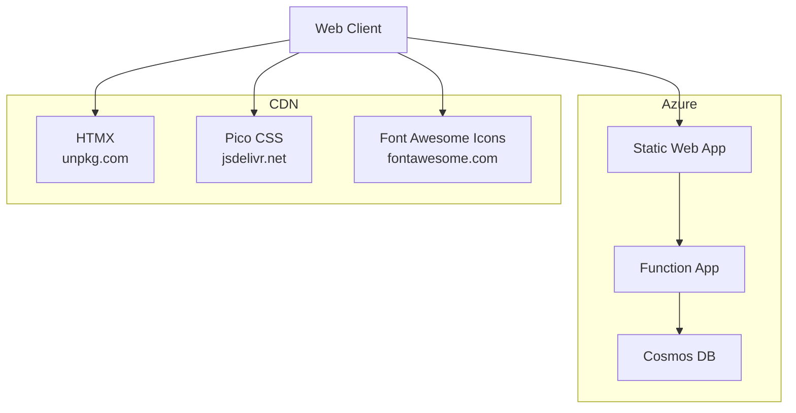

# az-todo-app: A Serverless List Manager App

See the demo [here](https://todo.jpto.dev/)

## Architecture

```mermaid
  graph TD;
    A[Web Client]-->B;
    A-->C;
    A-->F
    A-->G
    

    subgraph Azure
        B[Static Web App]
        D[Function App]
        E[Cosmos DB]

        B-->D;
        D-->E;
    end

    subgraph CDN
        C["`HTMX
        unpkg.com`" ]
        F["`Pico CSS
        jsdelivr.net`"]
        G["`Font Awesome Icons
        fontawesome.com`"]
    end


```
