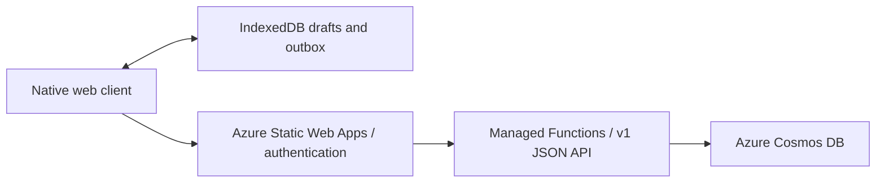

# az-todo-app: A Serverless List Manager

[Open the app](https://todo.jpto.dev/).

The client is native HTML, CSS and JavaScript ES modules with IndexedDB drafts,
an account-bound outbox and an offline shell. All current writes use `/api/v1/operations`.
There is no frontend build step, CDN dependency or HTMX runtime.

- [Task flow and parity verification](docs/task-flow.md)
- [Request security and deployed verification gates](docs/request-security.md)
- [Versioned API, conflict handling and migration tooling](docs/data-api-v1.md)
- [Offline inbox, upgrade and release procedure](docs/durable-inbox.md)
- [Design reference](DESIGN.md)

The canonical entry is `/`; `/inbox.html` remains a bookmark alias. Set the backend
`V1_API_ENABLED=true`, configure `APP_ORIGIN` for the exact environment origin and
retain the existing Cosmos connection settings. `V1_CLIENT_ENABLED` is retired:
legacy writes are always blocked, independently of flag values. Disabling v1
shows an unavailable error; it never falls back to legacy storage.

From `api/`, run `npm ci`, install Playwright Chromium (`npx playwright install chromium`),
and run `npm test` with Node 24+. On Windows with Edge installed, set
`PLAYWRIGHT_CHANNEL=msedge`. CI uses Node 24 and Chromium. The tests use production
handlers with a transactional in-memory storage substitute; deployed Cosmos/auth,
physical-device and screen-reader verification remain release gates.

PWA installation/update UX is #14, navigation redesign is #26, and account display
and sync documentation follow-up is #27. This release consolidates the existing
client and preserves its offline protocol.
