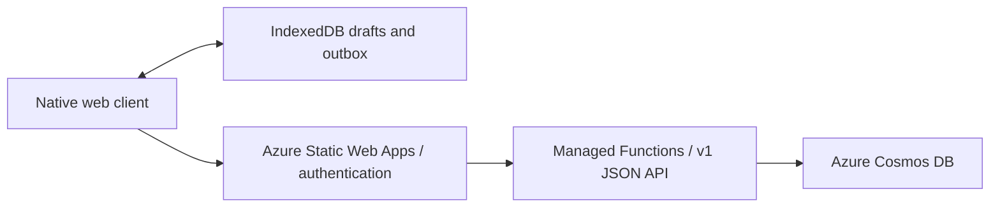

# az-todo-app: A Serverless List Manager

[Open the app](https://todo.jpto.dev/).

The client is native HTML, CSS and JavaScript ES modules with IndexedDB drafts,
an account-bound outbox and an offline shell. All current writes use `/api/v1/operations`.
There is no frontend build step, CDN dependency or HTMX runtime.

- [Capture, Your Work and List Workspace navigation](docs/navigation.md)
- [Task flow and parity verification](docs/task-flow.md)
- [Optional projects and planned-day views](docs/projects.md)
- [Release checklist, runtime and paid-pilot decision](docs/release-readiness.md)
- [Request security and deployed verification gates](docs/request-security.md)
- [Versioned API, conflict handling and migration tooling](docs/data-api-v1.md)
- [Opt-in isolated Cosmos protocol rehearsal](docs/cosmos-rehearsal.md)
- [Opt-in Cosmos RU, contention and catch-up measurements](docs/cosmos-measurements.md)
- [Offline inbox, upgrade and release procedure](docs/durable-inbox.md)
- [TaskGem browser handoff protocol and extension integration](docs/extension-handoff.md)
- [Portable device and server exports, and round-trip validation](docs/device-export.md)
- [Waiting, deferred work, dates and undo](docs/workflow-states.md)
- [Resumable daily and weekly reviews](docs/reviews.md)
- [Progressive clarification, saved proposals and explicit decisions](docs/clarification.md)
- [Optional local AI guidance and manual fallback](docs/local-guidance.md)
- [Editable briefs, revision decisions and selected-revision export](docs/briefs.md)
- [Keyboard focus, announcements and accessibility verification](docs/accessibility.md)
- [Multi-device sync and collision examples](docs/durable-inbox.md#using-the-same-account-on-phone-and-laptop)
- [Account partition decision and measurements](docs/data-api-v1.md#partition-decision-issue-27)
- [PWA installation, safe updates and device verification](docs/pwa-installation.md)
- [Design reference](DESIGN.md)

The canonical entry is `/`; `/inbox.html` remains a bookmark alias. Set the backend
`V1_API_ENABLED=true`, configure `APP_ORIGIN` for the exact environment origin and
retain the existing Cosmos connection settings. `V1_CLIENT_ENABLED` is retired:
legacy writes are always blocked, independently of flag values. Disabling v1
shows an unavailable error; it never falls back to legacy storage.

From `api/`, run `npm ci`, install Playwright Chromium (`npx playwright install chromium`),
and run `npm test` with Node 22.x. On Windows with Edge installed, set
`PLAYWRIGHT_CHANNEL=msedge`. CI and the managed SWA API both select Node 22.
The authenticated `/api/health` response reports the running version in
`X-Node-Version`; verify it after deployment. The tests use production
handlers with a transactional in-memory storage substitute; deployed Cosmos/auth,
physical-device and screen-reader verification remain release gates.

PWA installation is available from Preferences where the browser supports it;
manual installation guidance and safe update notices are included. Physical-device
and deployed installation verification remain #14/#17 release gates. Navigation
verification on physical devices and screen readers remains under #26/#17.
