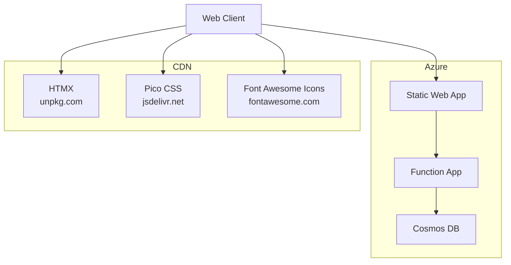

# az-todo-app: A Serverless List Manager App

See the demo [here](https://todo.jpto.dev/)

The current HTML/HTMX route contracts, local test commands, and verification
limits are documented in [Task flow verification](docs/task-flow.md).
Browser request protection, origin configuration, account isolation tests, and
Azure verification gates are documented in [Request security](docs/request-security.md).
The opt-in JSON contract, retry/conflict protocol and migration rehearsal are
documented in [Versioned data API](docs/data-api-v1.md).
Durable offline capture, editing, account-bound retry and controlled client cutover
are documented in [Durable inbox](docs/durable-inbox.md).
See [multi-device sync and collision examples](docs/durable-inbox.md#using-the-same-account-on-phone-and-laptop)
and the [account partition decision and measurements](docs/data-api-v1.md#partition-decision-issue-27).

## Architecture

## Components

- [Azure Static Web Apps](https://docs.microsoft.com/en-us/azure/static-web-apps/overview)
- [Azure Functions](https://docs.microsoft.com/en-us/azure/azure-functions/functions-overview)
- [Azure Cosmos DB](https://docs.microsoft.com/en-us/azure/cosmos-db/introduction)
- [HTMX](https://htmx.org)
- [Pico CSS](https://picocss.com)
- [Font Awesome](https://fontawesome.com)
- - Lightweight local CSS for components; minimal extra CSS to ensure responsive wrapping forms
