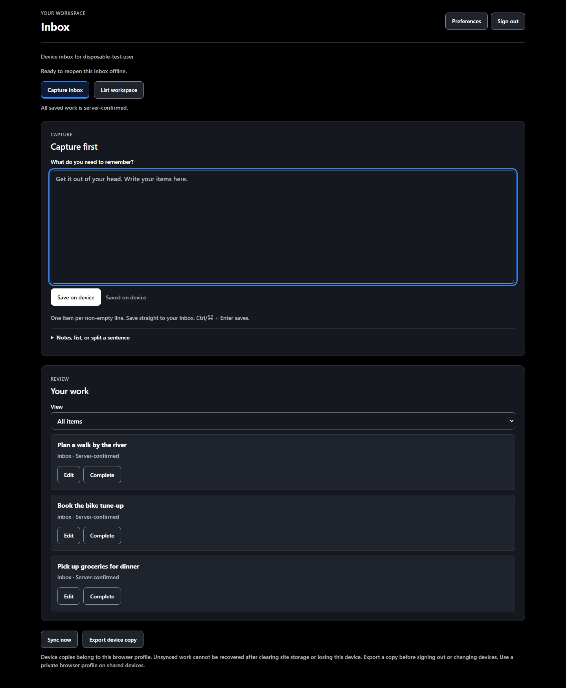

# Responsive workspace — issue 15

Reference: [HashiCorp design analysis](https://getdesign.md/hashicorp/design-md),
[component preview](https://getdesign.md/design-md/hashicorp/preview), and the
repository's [DESIGN.md](../../DESIGN.md). Baseline: `5dfa7a0`.

## Layout review and adopted proposal

The original HTMX screen puts a list-creation form before capture on phones,
expands every optional task field, and uses a fixed-width sidebar on desktop.
The durable inbox has its own dark stylesheet, a narrow single-column desktop
layout, and repeats long titles in action buttons. Neither offers a theme choice.

This pass uses one token system in `html/styles.css` for both clients. The
reference's black canvas, charcoal layers, white primary action, blue links,
restrained borders, 8px controls and 12px panels become app components. System
sans typography stays at 16px body, 14px supporting text, 22px section headings,
and 28px page titles. Spacing follows 4/8/12/16/24/32px. There are no added fonts,
dependencies, marketing layouts, logos, or product-color branding.

- HTMX: 248px list sidebar and flexible main column from 768px; one column below
  that. Native list navigation starts collapsed on phones and remains under user
  control. List creation and optional capture fields use native disclosures.
  Title, destination, and the save action remain visible.
- Inbox: a large full-width capture box is the default. The Capture inbox / List
  workspace switch hides or restores capture without discarding its draft. Both
  views use the same durable v1 records. Review stays below capture; sync/export
  controls follow the work area. Action labels retain full accessible names.
- Editing and preferences/settings use native modal dialogs: a 560px side panel
  on desktop and a bottom sheet below 768px. Native modality isolates background
  controls. Escape and closing the inbox editor preserve its draft for reopening
  or reload; saving clears it. Failed device saves close the sheet so the recovery
  copy stays reachable. Settings errors appear inside the open panel. Conflict
  comparisons remain in the work area.
- Shared states: readable metadata and empty/loading/error text, 44px controls,
  a 3px keyboard-focus outline, explicit disabled styling, and selected list
  borders with `aria-pressed`. Completion and sync states retain text labels.
  Settings, disclosures, and native dialogs inherit the same tokens.
- Appearance: dark is the default, including when the OS prefers light or storage
  is blocked. Preferences offers Dark, Light, and System; System follows live OS
  changes only when explicitly selected. The choice is browser-local and shared
  between clients and tabs. `theme.js`
  runs before CSS to avoid a saved-theme flash. Blocked storage still allows a
  choice for the current tab. Light mode is an app-specific adaptation required
  by issue 15, not a claim about the dark-only reference. CSS uses `light-dark()`
  and targets current browsers supporting that native feature.
- Accessibility takes precedence over reference colors: subdued copy uses the
  readable muted token instead of `#656a76`; dark errors use `#ff928b` and light
  links use `#005ec4`. Text state is never communicated by color alone.
- Offline shell cache moves to v3 and includes the shared CSS and theme script.
  As before, an existing worker waits for old tabs to close before activating.
  Task data and API/auth requests are not added to the shell cache.

## Evidence

Screenshots use disposable local test data, real application templates and
handlers, and mocked Cosmos storage. Chromium 153 on Windows; America/Regina;
900px viewport height. They are browser-content captures, not installed-PWA or
physical-device screenshots. Panels/sheets use viewport captures; other screens
use full-page captures. Dark is the new default; the baseline HTMX screen stayed
light. Baseline screenshots are preserved from before the first design pass.

| Width | HTMX before | HTMX after | Inbox before | Inbox after |
| --- | --- | --- | --- | --- |
| 320 | [Before](screenshots/before-workspace-320.png) | [After](screenshots/after-workspace-320.png) | [Before](screenshots/before-inbox-320.png) | [After](screenshots/after-inbox-320.png) |
| 390 | [Before](screenshots/before-workspace-390.png) | [After](screenshots/after-workspace-390.png) | [Before](screenshots/before-inbox-390.png) | [After](screenshots/after-inbox-390.png) |
| 768 | [Before](screenshots/before-workspace-768.png) | [After](screenshots/after-workspace-768.png) | [Before](screenshots/before-inbox-768.png) | [After](screenshots/after-inbox-768.png) |
| 1440 | [Before](screenshots/before-workspace-1440.png) | [After](screenshots/after-workspace-1440.png) | [Before](screenshots/before-inbox-1440.png) | [After](screenshots/after-inbox-1440.png) |

Additional evidence: [workspace keyboard focus](screenshots/after-workspace-keyboard-focus-320.png),
[inbox keyboard focus](screenshots/after-inbox-keyboard-focus-390.png),
[workspace light](screenshots/after-workspace-light-320.png),
[inbox light](screenshots/after-inbox-light-320.png).

Accepted-feedback evidence: [393px capture](screenshots/after-inbox-393.png),
[1366px laptop](screenshots/after-inbox-1366.png),
[2560px desktop](screenshots/after-inbox-2560.png),
[phone lists](screenshots/after-lists-390.png),
[desktop lists](screenshots/after-lists-1440.png),
[desktop editor panel](screenshots/after-editor-panel-1440.png),
[phone editor sheet](screenshots/after-editor-sheet-320.png), and
[phone settings sheet](screenshots/after-settings-sheet-320.png).



Run from `api/` with installed dependencies and Playwright Chromium:

```powershell
node --experimental-test-module-mocks --test test/*.test.mjs
$env:DESIGN_SCREENSHOTS='../docs/design/screenshots'
node --experimental-test-module-mocks --test test/design.test.mjs
```

All 33 checks passed. The design test checks seven widths, initially collapsed
phone navigation, capture visibility, expanded forms/settings, 200-character
unbroken titles, keyboard focus, theme reload persistence, live system theme
changes, dark default on a light OS, blocked localStorage, themed offline reload,
workspace switching, and modal focus/draft recovery. Existing tests cover
save failures, retained drafts, disabled saving controls, conflicts, account
isolation, and offline recovery.

Resolved text-token contrast against all three surfaces is at least **4.95:1
in light mode** and **4.59:1 in dark mode**. Primary action text also exceeds
4.5:1; focus and control-border tokens exceed 3:1 against those surfaces.
These are measured token pairs, not a claim of a complete accessibility audit.

Before screenshots were captured on the baseline with the same fixture using
`DESIGN_BASELINE=1`; preserve them when regenerating after screenshots.

## Accepted feedback and remaining follow-up

[The owner's answers](https://github.com/jpconstantineau/az-todo-app/issues/15#issuecomment-5945590120)
arrived before PR #23 merged, so the same PR now includes the large capture box,
workspace switch, panels/sheets, and dark default. Preferences remains local to
the browser; account synchronization was not requested.

The list switch uses v1 records rather than reconnecting the legacy writer.
The existing migration gate is preserved: when `V1_CLIENT_ENABLED=true`, `/`
already opens the inbox; before migration, the legacy entry point remains in
place. This design PR does not enable production flags or migrate user data.

AI extraction is a requested follow-up, not simulated by this UI. The large box
still saves one item per non-empty line and preserves the original input. The
[remaining question](https://github.com/jpconstantineau/az-todo-app/issues/15#issuecomment-5945641249)
asks which AI service/model to use and whether users should review an editable
extraction preview before committing tasks/attributes. No capture is sent to AI.

Issue 15 remains open. Actual installed-PWA screenshots and physical soft-keyboard,
safe-area, and non-Chromium verification remain outstanding. PWA preparation is
deferred per the owner, who plans testing on a Pixel 4a, laptop, and 2K screen.
There is currently no install manifest. The extra viewport captures supplement,
but do not replace, those real-device checks.
Future clarification/review/brief screens should load the shared CSS rather than
copy tokens, but those screens are not invented here.

If further answers arrive before merge, update PR #23. After merge, fetch
then-current `main` and start a fresh follow-up branch
and PR (or update a retained branch to that merged base before adding new work).
Reference issue 15 and this PR; do not depend on reopening the original PR or
reapply its commits after a squash merge. Re-run the relevant viewport/state
checks and append new evidence for the answered decisions.
